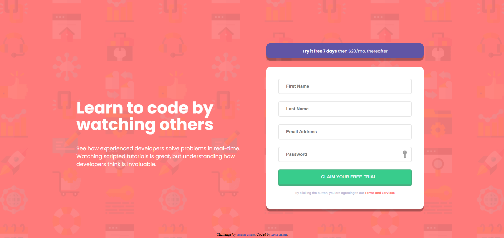

# Frontend Mentor - Intro component with sign up form solution

This is a solution to the [Intro component with sign up form challenge on Frontend Mentor](https://www.frontendmentor.io/challenges/intro-component-with-signup-form-5cf91bd49edda32581d28fd1). Frontend Mentor challenges help you improve your coding skills by building realistic projects. 

## Table of contents

- [Overview](#overview)
  - [The challenge](#the-challenge)
  - [Screenshot](#screenshot)
  - [Links](#links)
- [My process](#my-process)
  - [Built with](#built-with)
  - [What I learned](#what-i-learned)
  - [Continued development](#continued-development)
  - [Useful resources](#useful-resources)
- [Author](#author)
- [Acknowledgments](#acknowledgments)

## Overview

### The challenge

Users should be able to:

- View the optimal layout for the site depending on their device's screen size
- See hover states for all interactive elements on the page
- Receive an error message when the `form` is submitted if:
  - Any `input` field is empty. The message for this error should say *"[Field Name] cannot be empty"*
  - The email address is not formatted correctly (i.e. a correct email address should have this structure: `name@host.tld`). The message for this error should say *"Looks like this is not an email"*

### Screenshot



### Links

- Solution URL: [Github Code](https://github.com/Bry-cmd/intro-component-with-signup-form-master)
- Live Site URL: [Live Site](https://bry-cmd.github.io/intro-component-with-signup-form-master/)

## My process

### Built with

- Semantic HTML5 markup
- CSS custom properties
- CSS Grid
- Desktop-first workflow
- Vanilla JavaScript

### What I learned

My significant learnings were JS-related because this was my first challenge that required JS. These learnings include how to select an HTML element from my HTML file, as well as adding and altering properties of said HTML element. These are sampled below:

```js
// Selecting div with class "form" from HTML file
let div_form = document.querySelector("div.form");

// Adding click event listener to an HTML element
div_form.addEventListener("click", function() {alert("Element clicked")});
}

// Adding or removing "error" class from an HTML element
div_form.classList.add("error");
div_form.classList.remove("Error");
```

### Continued development

For future projects, I definitely want to learn how to create more complex functions in JS, so that I can create more dynamic websites, and learn better coding practices especially for JS. As of right now, I just grouped my JS code in different parts depending on their different purposes in the site. However, I wish to learn of better practices on how to keep the code organized and readable.

In terms of CSS, I wish to figure out how to create more responsive websites. As of now, I'm exploring the use of rem and % units to create responsive designs and I'm not sure which one to use yet. I also wish to learn more about flexbox, since all of my challenges so far have been done with grid.

For HTML, I wish to learn of tags that are more appropriate or fitting for different sections of the webpage. Most of my tags for containers are div's and I'm aware of other, more fitting tags, such as the main and article tags, but I'm still unsure as to when to use them.

### Useful resources

- [W3Schools](https://www.w3schools.com/) - This helped me a lot in answering basic syntax questions and provided many examples that clarified how to use them.
- [Stack Overflow](https://stackoverflow.com/) - This site provided a lot of answers to questions I've had while coding the website, especially in resolving errors I've encountered.

## Author

- Github - [Bry-cmd](https://github.com/Bry-cmd)
- Frontend Mentor - [@Bry-cmd](https://www.frontendmentor.io/profile/Bry-cmd)

## Acknowledgments

I would like to thank [@B1N4R1](https://www.frontendmentor.io/profile/B1N4R1) for providing feedback, regarding responsive design, on my previous challenge's solution, which I've tried to improve on in this challenge.